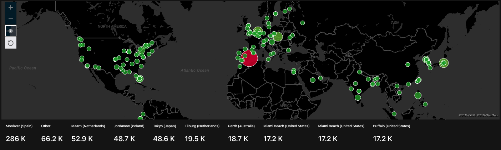
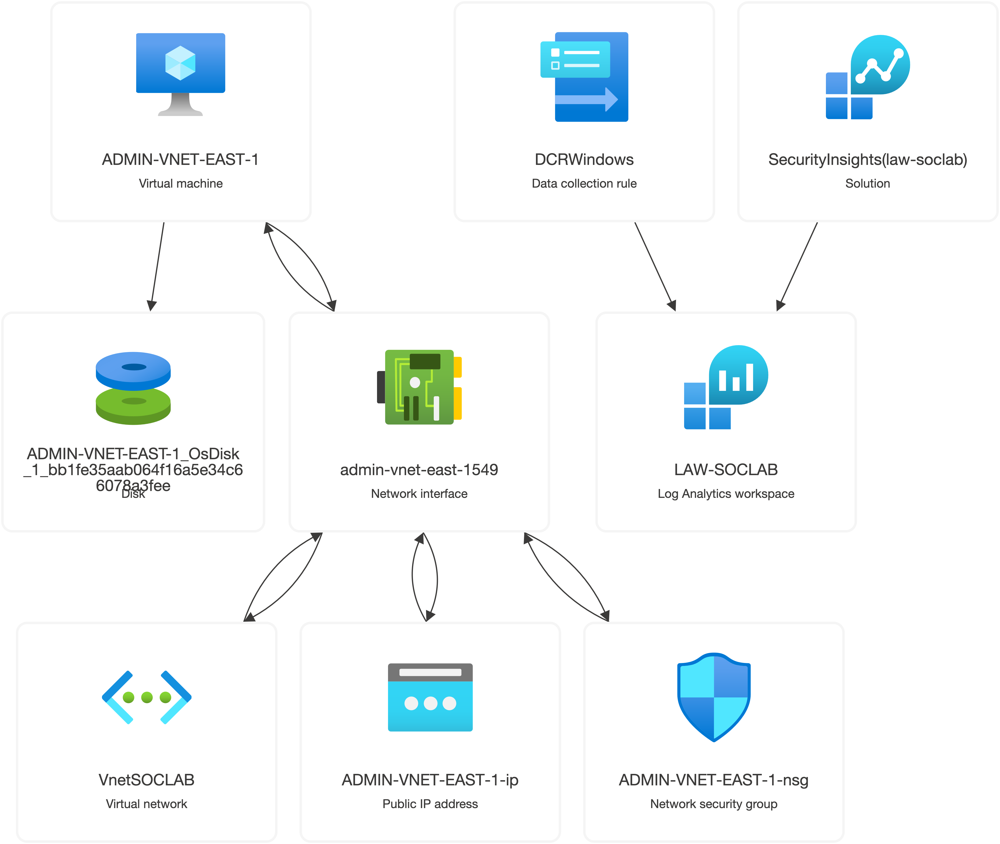
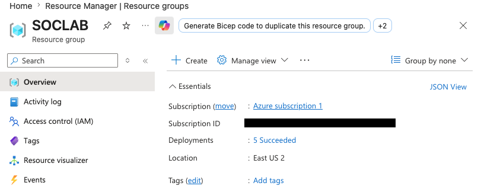
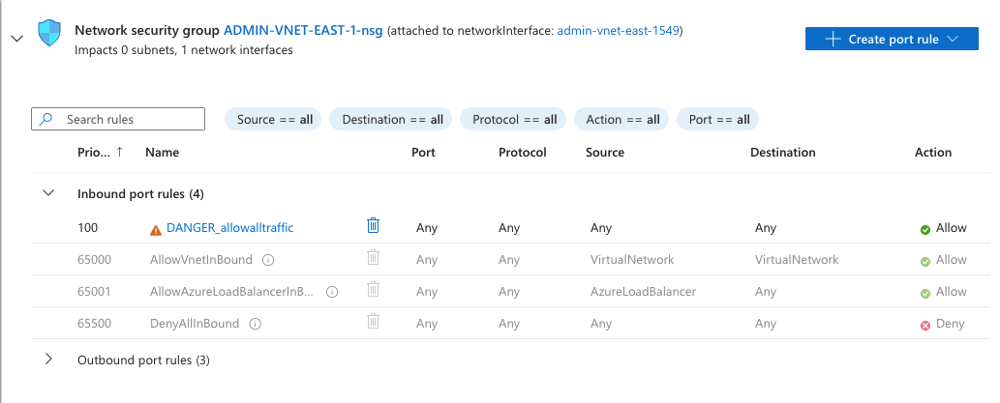
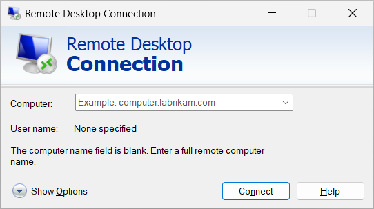
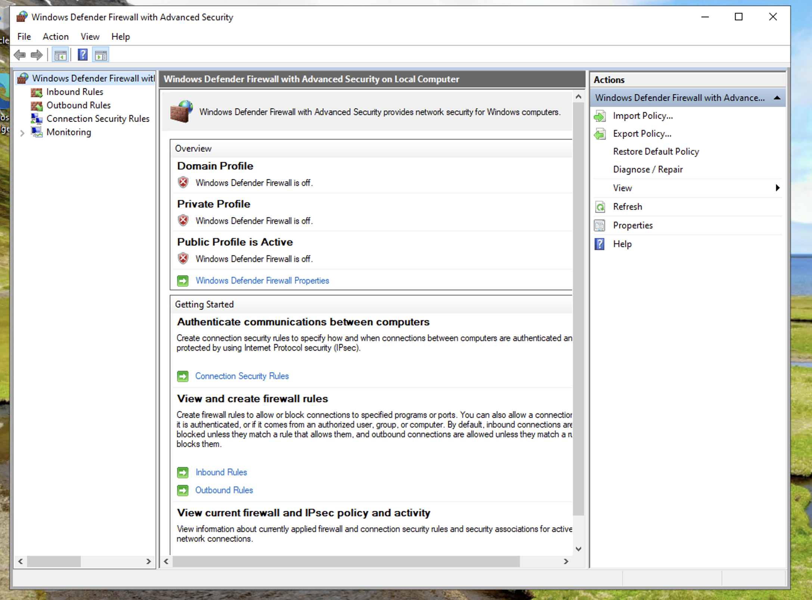
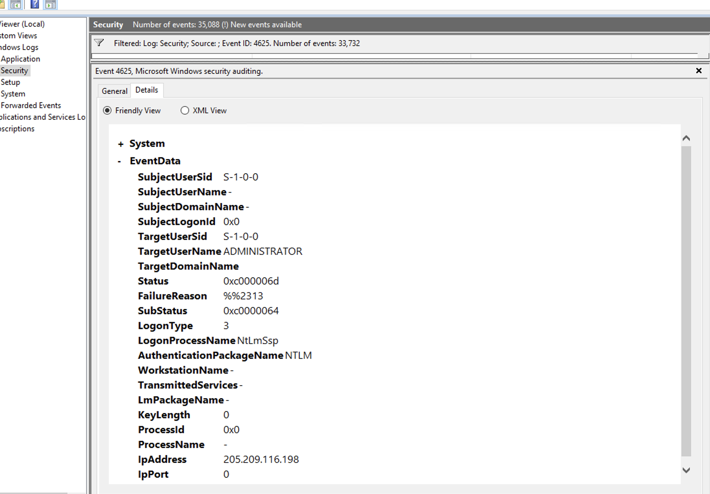
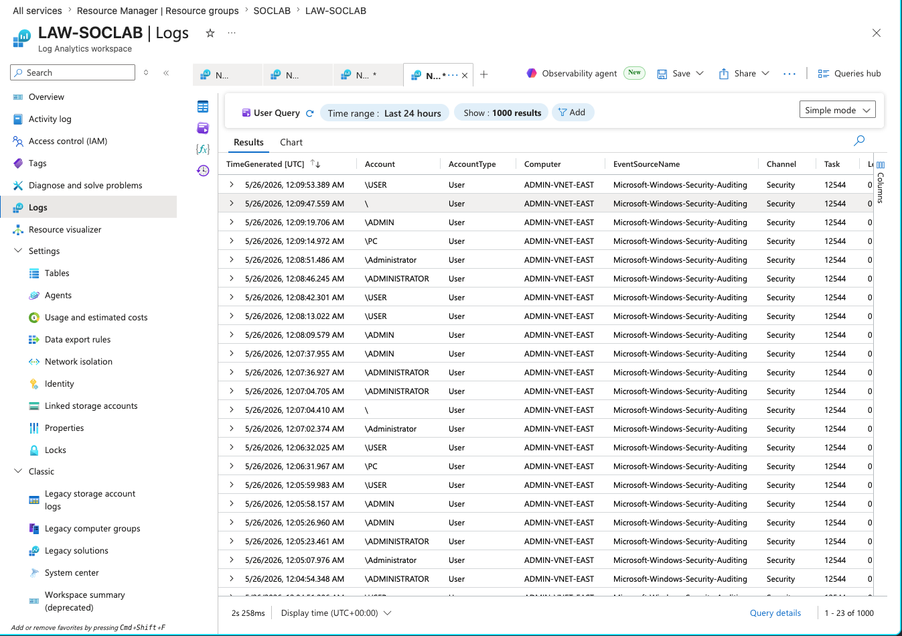
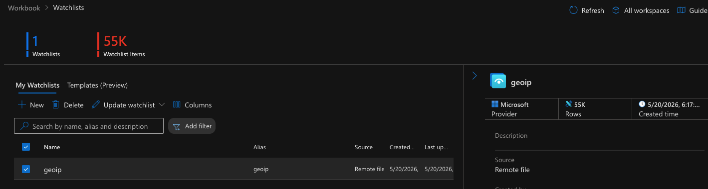

<h1>How Dangerous is the Internet?...It's Pretty Bad.</h1>

<h2>Description</h2>
This home lab project is meant to signify how bad it is to host an IoT device with default credentials on the open internet. Below is the documentation and steps I took to create a simple honeypot on Microsoft Azure. The main idea is to host a vulnerable virtual machine on a vulnerable network and see who tries to connect to it via virtual desktop and from where. I used workbook on Microsoft Defender to map all IP's who failed to login (Event ID 4625).
 

<h2>Languages and Utilities Used</h2>

- <b>KQL
- Windows Security Logs</b> 

<h2>Environments Used </h2>

- <b>Microsoft Azure
- Windows 11 VM
- Azure Network Interface
- Azure Log Analytics Workspace
- Azure Virtual Network
- Microsoft Defender Workbook (Sentinel)</b> 

<h2>Fig. 1: Honeypot Connections Within 144 Hours:</h2>

  

- This is a map of all IP addresses that attempted to connection to my honeypot. As you can see there are quite a lot, 286K connections from Spain alone. All of these attemped logins simply having the honeypot connected to the internet. The only alure to my honeypot was the name "ADMIN-VNET-EAST-1". This was enough to have people attempt to login with usernames such as "Admin", "Administrator", "ADMINISTRATOR", "User", "1", Guest", and "VNET".

<h2>How I Made This</h2>

- I was able to assemble this home lab within the free trail of Microsoft Azure. To start, I created a Resource Manager entitled "SOCLAB". Here is a Resource Diagram of all the components within the Resouce Group.

  

 
Let's break this down...

<h2>Fig. 2: Resource Group Creation:</h2>

  

 

- Start by creating a Resource Group in Azure. I named mine "SOCLAB" and set the location as East US 2, but the exact location does not matter too much.

<h2>Fig. 3: Virtual Machine Creation:</h2>

  

 

- <b>Create a virtual machine</b> within the Resouce Group. I named mine "ADMIN-VNET-EAST-1". This name should be something enticing for hackers or bots to try and break into. Any name that sounds important that isn't "Honeypot" should be work just fine. Also make sure to create a memorable password so you don't have to reset it 3 times like I did.
- <b>Configure the network</b> to make the VM vulnerable. Go into the Network Settings of the VM, and hit <b>Create port rule</b>. Add a port rule which allows all inbound traffic from all ports. I threw the word "DANGER" into the name of my rule to signify that allowing all traffic is indeed dangerous

<h2>Fig. 5: Windows Remote Connection:</h2>

  

 

- If you are on a Windows machine, search <b>Remote Desktop</b> in the search bar. This should pull up the Remote Desktop Connection application, and the windows should look like the one above. Type in your Azure VM's Public IP address, and the password you chose. This should allow you to access the actual VM you created in Azure.

<h2>Fig. 6: Disabling Windows Defender Firewall:</h2>

  

 

- Type in "Windows Defender Firewall" in the windows search bar to bring up the firewall configurations for your VM. Click on "Windows Defender Firewall Properties" and hit "Turn off Windows Defender Firewall" for the Domain Profile, Private Profile, and Public Profile. When configured correctly, your Windows Firewall page should look like the image above. <b> NOTE: Please do NOT do this on a machine you care about.</b>
 

After this step, all setup is complete for your Honeypot. Hackers on the internet may begin attempting to connect to your VM.

<h2>Fig. 7: Window Security Log Event ID 4625:</h2>

  

 

How do we see if someone attempts to login to our machine?

- Windows stores everything that happens on the machine in event logs. Type in "Event Viewer" in the Windows search bar to open the Event Viewer. On the left hand side, find the dropdown folder labled "Windows Logs", then click "Security". Here, you will see all the securtiy logs of the machine. On the right hand side of the Security view, click on "Filter Logs", and where it propts for an Event ID, type in "4625". Event 4625 is a failed login attempt, and when a hacker tries to access our machine, the event will be stored here, along with some additional details. <b>NOTE: There may not be any logs in here yet, you could purposefully fail a login to the VM in order to see a 4625 event.</b> 
- Once you see a 4625 event has been logged, click on it. Then click "Details" to get the view from Fig. 7. This is a real attacker attempting to login to my machine. Their IpAddress was <b>205.209.116.198</b>, and the TargetUserName was <b>ADMINISTRATOR"</b>. 

<h2>Fig. 8: Azure Log Analystics Workspace:</h2>

  

 

- Go back into Azure and create a "Log Analytics Workspace". This is how we'll get the logs from our VM into Azure for analysis. Make sure you link it to the Resource Group we created.
- On the left hand side, click on "Logs". Create a query for searching the logs using KQL mode. The simplest way to search for EventID 4625 would be:

SecuityEvent
| where EventID == "4625"

- After running this KQL Query, all logs for the Event ID 4625 should appear as they do in Fig. 8.

<h2>Fig. 9: Resolving the IPs to Real Locations:</h2>

  

 

- Next, search for "Microsoft Sentinel" in Azure. Click on your Resource Group, and then navigate to "Watchlist" under the "Configuration" dropdown. The functionalisty of Sentinel is being moved to Microsoft Defender, so click on the link which will take you to the Defender portal
- On the left hand side of Defender, click on Sentinel > Configuration > Watchlist. Create a new watchlist from a .csv, and use the "geopip-summarized.csv" from the project files in this respository.
- After the geoip csv has been uploaded, your watchlist list should look like Fig. 9 The purpose of this .csv is to categorize the IP addresses we recieve into their respective locations
  
<h2>Fig. 10: Using Sentinel Workbook to Map the Locations:</h2>

  

 

- In Defender, navigate to Microsoft Sentinel > Threat management > Workbooks. Click "Add Workbook", then click "Edit". Delete whatever default information is created here, and click "+Add" on the left side. Click on "Add data source + visualization". On the top right of the new query click on "Advanced Editor" and copy/paste the code from this repository entitled "map.json". Click "Apply", then Run Query", and then "Apply Changes" on the rop right.
- Now we're done! You should be looking at a map of the work populated with dots from where attackers attempt to access your VM.
- You can play around with the map settings in the workbook to customize your view how you like.

<h2>My key takeaways from this home lab project:</h2>

- Within an hour of setting up the honeypot, I had unauthorized users attempting to connect to my SOCLAB machine.
- If I had been using default credentials such as Admin/Password, or Administrator/Password, I have no doubt my VM would have been broken into.
- This goes to show that IoT devices simpy cannot be left on a network connected to the internet with default credentials.
